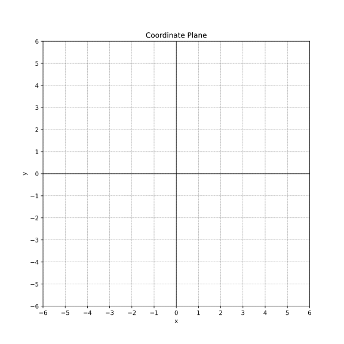
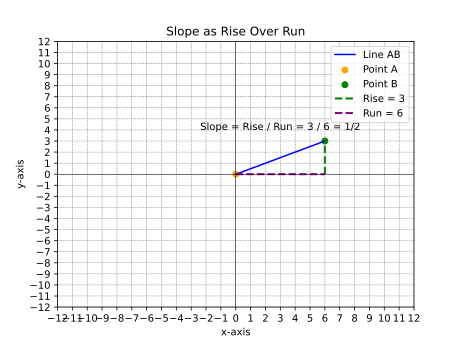
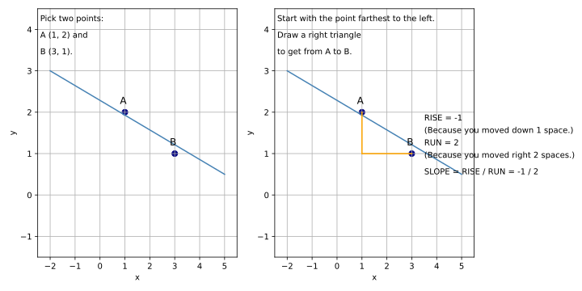

# The Line 

## 1. introduction 

We encounter lines all the time in real life, often without even realizing it.
Think about:

- the cost of your cell phone bill increasing with each minute you use,
- the distance a car travels over time at a constant speed,
- “going viral”: increase of followers over time.

These situations can be represented by lines on a graph, showing how one thing changes in relation to another.

Many of these lines – in fact, almost all the ones we'll come across in many situations – can be described by a special equation called the gradient-intercept form.   **𝑦 = 𝑚𝑥 + 𝑐** (this is called the **slope-intercept form** or **gradient-intercept form**

---
## 2. The coordinate plane 

*Let's review the coordinate plane. It helps us draw the lines.*

A **coordinate plane** is a flat surface formed by the intersection of two lines called **AXES**. 

- the horizontal line = **X-AXIS**
- vertical line = **Y-AXIS**
- the point where they interect = **ORIGIN**

Key Facts about the **coordinate plane** is also called 

- It is also called the **cartesian plane**  or **grid system**
- it can be used to represent each point each by using a**pair of numbers** called **coordinates**
- the coordinates of a point are always given as $(X,Y)$
- It has **4** quadrants which are usually labeled **ANTI-CLOCKWISE**
  

---

## 2. slope - intercept form 

The gradient-intercept form of a linear equation is: 

**y = mx + c**

This equation acts like a secret code that unlocks important information about the line, telling us **how steep** it is and **where it starts** on the graph.

* **m** represents **the gradient**. (sometimes it is also called **slope** )
* **c** represents the **y-intercept**.

## 2.1. slope as RISE OVER RUN 

- In mathematical terms, the gradient is the *change in the y-value* **divided** by *the change in the x-value* **(RISE OVER RUN)**.

## 2.2. Types of slopes 

A **positive gradient** means the line slopes upwards from left to right.

A **negative gradient** means the line slopes downwards from left to right.

## 2.3 finding the slope from a chart 

if you have a chart of a line, there are two ways you can **find the sloe**

A) by using the chart 

Chart 1: Pick Two Points

    Two points are selected on the line: A(1,2)A(1,2) and B(3,1)B(3,1).
    The line is plotted, and the points are clearly labeled.

Chart 2: Find Rise and Run

    A right triangle is drawn between the two points, illustrating the "rise" (−1−1) and "run" (22).
    The dashed lines highlight the vertical and horizontal distances between the points.

B) by using the **formula for the slope**

  
---

## 3. find the equation of a line 

remember a line is given by the equation : **y = mx + c**

you need to find the **m** and **c**

there are 4 situations 

- you are given the equation
- you are given the slope and one point
- you are given two points
- you are given a chart

---

