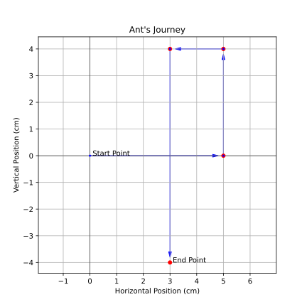

# Motion 

## 1. Intro 

- Moving just means going from a position to another (one point to another)
- Motion = **change of position**

- when we move, we cover a **distance** i.e. the length between one point to another
- **distance** = measurement of how parts two points/two objects are from each other , are far apart

## 2. Distance and Displacement 

Imagine an ant is trying to reach a drop of honey. It doesn't walk in a straight line. It walks around pebbles, over twigs, and maybe even takes a detour to avoid a spider!

1) how many total segments does the ant's path have?
2) In which directions does the ant move during its journey?
3) What is the total distance traveled by the ant?
4) What is the starting point of the ant? What is the ending point?
5) Compare the total distance the ant traveled with the straight-line displacement. Which is larger? Why?
6) If the ant walks in a square and returns to its starting point
   - a) what would its displacement be?
   - b) What would its total distance be?
8) Can displacement ever be greater than distance? Why or why not ?

---
**REMEMBER**

**Distance**: The total length of the path traveled by an object. It's a scalar quantity, meaning it only has magnitude (a numerical value). Think of it as the reading on your car's odometer.

**Displacement**: The change in position of an object. It's a vector quantity, meaning it has both magnitude and direction. It's the straight-line distance between the starting and ending points, with a direction. Imagine drawing a straight arrow from where you started to where you finished.

- When talking about **distance** we only state the *numerical value*
  
• for example: 14 cm and not 14 centimeters northeast or anything like that).
         
• This means we have only one value, *the magnitude*. This type of values is called a **scalar**. 

- When talking about **displacement**, we state the  *numerical value* and also add the *direction*
  
• for example: 7 centimeters northeast of its starting point
         
• So, we have two values: the *magnitude and the direction*. This type of values is called a **vector**.

---

    
