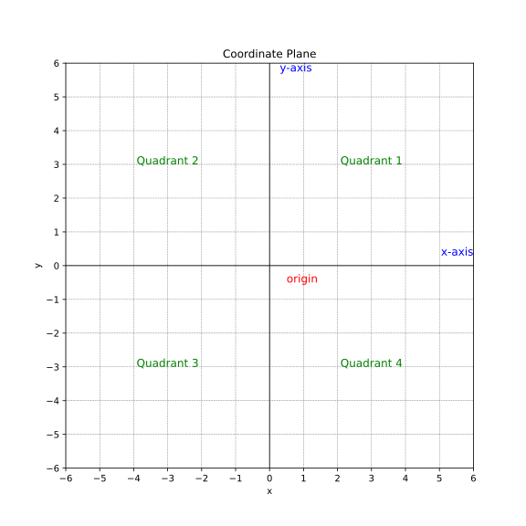
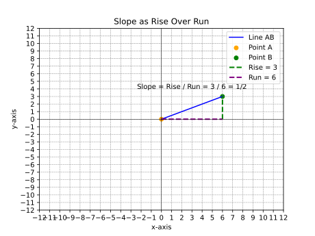
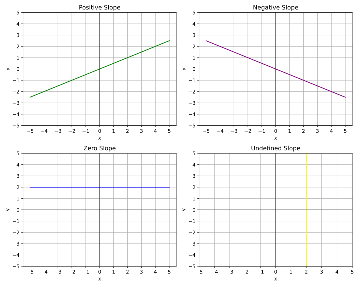

# The Line 

## 1. introduction 

We encounter lines all the time in real life, often without even realizing it.
Think about:

- the cost of your cell phone bill increasing with each minute you use,
- the distance a car travels over time at a constant speed,
- “going viral”: increase of followers over time.

These situations can be represented by lines on a graph, showing how one thing changes in relation to another.

Many of these lines – in fact, almost all the ones we'll come across in many situations – can be described by a special equation called the gradient-intercept form.   **𝑦 = 𝑚𝑥 + 𝑐** (this is called the **slope-intercept form** or **gradient-intercept form**


---
## 2. The coordinate plane 

*Let's review the coordinate plane. It helps us draw the lines.*


A **coordinate plane** is a flat surface formed by the intersection of two lines called **AXES**. 

- the horizontal line = **X-AXIS**
- vertical line = **Y-AXIS**
- the point where they interect = **ORIGIN**

Key Facts about the **coordinate plane** is also called 

- It is also called the **cartesian plane**  or **grid system**
- it can be used to represent each point each by using a**pair of numbers** called **coordinates**
- the coordinates of a point are always given as $(X,Y)$
- It has **4** quadrants which are usually labeled **ANTI-CLOCKWISE**
  




---

## 2. slope - intercept form 

The slope-intercept form of a linear equation is: 

**y = mx + c**

This equation acts like a secret code that unlocks important information about the line, telling us **how steep** it is and **where it starts** on the graph.

* **m** represents **the gradient**. (sometimes it is also called **slope** )
* **c** represents the **y-intercept**.

    ! when the equation is written in this form $Ax + By = X$ , it is said that it is written in **standard form**
       Here we deal only with the **slope-intercept form** also called **gradient-intercept** form 

## 2.1. slope as RISE OVER RUN 

- In mathematical terms, the gradient is the *change in the y-value* **divided** by *the change in the x-value* **(RISE OVER RUN)**.




## 2.2. Types of slopes or four types of gradients  


EXPLAIN !!!! 

* A **positive gradient** means the line slopes upwards from left to right.

* A **negative gradient** means the line slopes downwards from left to right.

* A **zero gradient** is horizontal. It means that the rise is **zero** and 0 divided by any number is zero

* An **undefined slope** a perfectly vertical line . It is underfined because any number divided by zero is **underfined**





--- 
## 3. find the equation of a line 

finding the equation of a line means finding:
- **m** : the slope or gradient
- **c**: the intercept

and then writing it as $y=mx+c$

There are 4 situations 

- you are given the equation in different form 
- you are given a line in coordinates system 
- you are given two points
- you are given the slope and one point

### 3.1 when given an equation in different form 

for example 

$3x + 2y = 15$ 

in that case simply **re-arrange** the equation to put it in the form $y=mx+c$ (slope-intercept form) 


```
The slope-intercept form of a linear equation is:

y = mx + b

Where:

    m is the slope of the line.

    b is the y-intercept (the point where the line crosses the y-axis).

Solution 

    Isolate the y term:

    Our equation is:
    3x + 2y = 15

    To isolate 2y, subtract 3x from both sides of the equation:
    2y = -3x + 15

    Solve for y:

    Divide both sides by 2 to get y alone:
    y = (-3/2)x + 15/2

Result

The equation in slope-intercept form is: y = (-3/2)x + 7.5
```


### 3.2 when given a line in coordinates system 


The first step is to find the **slope**

if you have a chart of a line, there are two ways you can **find the slope**

A) by using the chart 


Chart 1: Pick Two Points

    Two points are selected on the line: A(1,2) and B(3,1).
    The line is plotted, and the points are clearly labeled.

Chart 2: Find Rise and Run

    A right triangle is drawn between the two points, illustrating the "rise" (−1−1) and "run" (22).
    The dashed lines highlight the vertical and horizontal distances between the points.


B) by using the **formula for the slope**

Rember slope is rise over run $\frac{rise}{run}$

Slope is calculated as:

$slope = \frac{\text{change in y}}{\text{change in x}} = \frac{y_2 - y_1}{x_2 - x_1}$


In the example above we had two points A = (1,2) and B = (3,1)  


x | y |
--|--|
1|2|
3|1

$slope = \frac{\text{change in y}}{\text{change in x}} = \frac{1 - 2}{3 - 1} = \frac{-1}{2}= -\frac{1}{2}$ 

now that we have the slope $-\frac{1}{2}$ 

we need to find **c**

- we know that $y = mx + c$ 
- so $y=-\frac{1}{2}x + c$
-  we can use any of the points the line pass through to find **c**
- we just have to **plug it** into the formula

  if we take the point  $A = (1,2)$ , remember this is is $x,y$

  so IF **PLUG** the values in the equation we get 

  $2 = -\frac{1}{2} + c$

  we isolate c

  $2 + -\frac{1}{2} = c$

  $2 -0.5 = c$

  $c = 1.5$

  so for this line

  $m=-\frac{1}{2}$ and $c=1.5$

  so the equation of the line is

  $y = -\frac{1}{2}x + 1.5$


### 3.3 when you are given two points 

when you are given two points 
- first find **m** by using the **formula for the slope**
- second : find **c** by **pluging the values of one point** into the equation of the line $y=mx+c$

example:

**find the equation of a line which passes through two points A=(2,4) and B= (5,10)**

**Step 1: find m**

point|  x | y |
--|--|--|
A|2|4|
B|5|10|

remember the formula of the slope :

$slope = m = \frac{\text{change in y}}{\text{change in x}} $ 

$m = \frac{10-4}{5 - 2} = \frac{6}{3}= 2$

$m=2$

**Step 2: find c** by **PLUGING IN THE VALUES OF ONE POINT**

the equation of the line $y=mx+c$

m = 2 

y = 2x + c 

to find c we can use point A=(2,4) or B= (5,10)

we use point B


in point B : x = 5, y = 10 

4 = 2 * 5 + c 

4 = 10 + c 

we isolate c 

4-10 = c 

-6 = c 

so c = -6 

we have m = 2 and c = -6 

so the equation of the line is $y = 2x - 6$

### 3.3 when you are one point and the slope 

that means you have **m** and just have to find **c**

example:

**find the equation of a line which passes through the point (4,6) and has a slope of -3**

equation of a line is $y=mx + c$

**m= -3**

the task is to find **c** by **PLUGING IN THE VALUES OF ONE POINT**

x = 4 and y = 6 

so 
6 = -3 * 4 + c 

6 = -12 + c 

we isolate c 

6 + 12 = c 

c = 18 

with m = -3 and c = 18 the equation of the line is 

$y = -3x + 18$

---

## 4. parallel and perpendicular lines 


## 5. Simultaneous equations 


