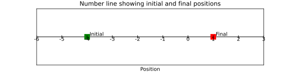

## 1. Intro 

- Moving just means going from a position to another (one point to another)
- Motion = **change of position**

- when we move, we cover a **distance** i.e. the length between one point to another
- **distance** = measurement of how parts two points/two objects are from each other , are far apart

## 2. Distance and Displacement 

### Example 1 

Imagine an ant is trying to reach a drop of honey. It doesn't walk in a straight line. It walks around pebbles, over twigs, and maybe even takes a detour to avoid a spider!

1) how many total segments does the ant's path have?
2) In which directions does the ant move during its journey?
3) What is the total distance traveled by the ant?
4) What is the starting point of the ant? What is the ending point?
5) Compare the total distance the ant traveled with the straight-line displacement. Which is larger? Why?
6) If the ant walks in a square and returns to its starting point
   - a) what would its displacement be?
   - b) What would its total distance be?
8) Can displacement ever be greater than distance? Why or why not ?

### Example 2

Below is a movement of cat in meters. The cat starts at some position (initial) and moves to another position (final).

a) What is the initial position of the cat?
b) What is the final position of the cat?
c) If the cat travelled in a straight line from the initial to the final position, what distance did it travel?
d) If the cat travelled in a straight line from the initial to the final position, what is its displacement ? 

---
**REMEMBER**

**Distance**: The total length of the path traveled by an object. It's a scalar quantity, meaning it only has magnitude (a numerical value). Think of it as the reading on your car's odometer.

**Displacement**: The change in position of an object. It's a vector quantity, meaning it has both magnitude and direction. It's the straight-line distance between the starting and ending points, with a direction. Imagine drawing a straight arrow from where you started to where you finished.

- When talking about **distance** we only state the *numerical value*
  
• for example: 14 cm and not 14 centimeters northeast or anything like that).
         
• This means we have only one value, *the magnitude*. This type of values is called a **scalar**. 

- When talking about **displacement**, we state the  *numerical value* and also add the *direction*
  
• for example: 7 centimeters northeast of its starting point
         
• So, we have two values: the *magnitude and the direction*. This type of values is called a **vector**.

---

## 3. Speed and Velocity 

#### Speed 
- Speed is a measeure of how fast you are going
- When we talk about speed we specify which distance something is traveling in a given amount of time.
- For example , imagine a cheetah chasing a gazelle. We can say that cheetah runs 100 meters in 4 seconds.

$Speed = \frac{Distance}{Time}$ 

in this case 

$\text{Speed of the cheetah}= \frac{Distance}{Time} = \frac{100 m}{4 seconds} = 25 meters per second (m/s)$ 

#### Velocity 
As we have distance and displacement, we also have Speed and Velocity 

**Velocity: Speed with a Direction** 

The Airplane's Flight: Now, consider an airplane flying. Let's say it's traveling at 600 kilometers per hour (km/h).

"Is this enough information to fully describe the airplane's motion?"

-  knowing only the speed isn't enough.
-  We also need to know the direction. Is it flying north, south, east, or west?

- Speed is a scalar quantity – it only has magnitude (25 m/s in this case) and no direction. 
- Velocity is a vector quantity – it has both magnitude (600 km/h) and direction (east).

$Velocity = \frac{Displacement}{Time}$ 

## 4. Acceleration 

When people run, fall, cycle or travel in a car or a plane their speed will change. 

**Acceleration**  is the change of velocity by time taken. 

It is the amount that velocity changes per unit time.

$\text{acceleration} = \frac{\text{change in velocity}}{\text{time taken}}$

$\alpha = \frac{v-u}{t}$

where 

- acceleration ($\alpha$) is measured in metres per second squared (m/s2)
- change in velocity (v - u) is measured in metres per second (m/s)
- time taken (t) is measured in seconds (s)

If an object is 
- speeding up (**acceleration**)
- slowing down (**deceleration**) .*its acceleration has a negative value*

Example of a motion without accelaration (**steady speed**)

Example of a motion with  accelaration 

## 5. Time Distance Graph 

Graphs can help us study motion 

here are some data about a race by Usain Bolt 

distance_data = [10, 20, 30, 40, 50, 60, 70, 80, 90, 100]
time_data = [1.88, 2.88, 3.78, 4.64, 5.47, 6.29, 7.1, 7.92, 8.74, 9.58]

here if we show the data as a GIF 

example 

Graphs of motion

- The gradient of a distance–time graph represents the speed.
- The gradient of a velocity–time graph represents the acceleration.
- The area under a velocity–time graph between two times represents the distance traveled during the time period.

---
# Accelaration - the SUVAT equations 

## Deriving the the SUVAT equations step-by-step starting from the definition of acceleration $a = \frac{v - u}{t}$, assuming constant acceleration.

The term "SUVAT equations" is an acronym

*   **S** - **Displacement** (sometimes denoted as $x$ or $\Delta x$ as well, but $s$ is common in SUVAT context). Displacement is the change in position of an object and is a vector quantity. It's the distance in a specific direction.
*   **U** - **Initial velocity**. This is the velocity of the object at the *beginning* of the time interval you are considering.
*   **V** - **Final velocity**. This is the velocity of the object at the *end* of the time interval you are considering.
*   **A** - **Acceleration**. This is the rate of change of velocity. For SUVAT equations to be directly applicable, the acceleration must be *constant* or *uniform*.
*   **T** - **Time**. This is the duration over which the motion is being considered. It's the time interval during which the velocity changes from $u$ to $v$ under the constant acceleration $a$.

So, the acronym **SUVAT** simply lists the key variables that appear in the equations of motion for constant acceleration. It's a convenient mnemonic used primarily in introductory physics and mechanics, especially in educational settings in some parts of the world (particularly in the UK education system and those influenced by it).

In summary, they are called SUVAT equations because the acronym SUVAT is formed by taking the first letter of each of the five kinematic quantities they relate: **S**isplacement, **U**nitial velocity, **V**inal velocity, **A**cceleration, and **T**ime.  It's a helpful way to remember the set of equations and the variables they involve.

**1. Derivation of the first equation of motion:  $v = u + at$**

*   **Start with the definition of acceleration:**
    Acceleration is defined as the rate of change of velocity. For constant acceleration, we can write it as:
    $a = \frac{\text{Change in velocity}}{\text{Time taken}}$

*   **Express "Change in velocity" and "Time taken" in terms of initial and final velocities and time:**
    Let:
    *   $u$ be the initial velocity at time $t=0$
    *   $v$ be the final velocity at time $t$
    *   $a$ be the constant acceleration
    *   $t$ be the time interval

    Then, the change in velocity is $v - u$, and the time taken is $t - 0 = t$.

*   **Substitute these into the definition of acceleration:**
    $a = \frac{v - u}{t}$

*   **Rearrange the equation to solve for $v$ (final velocity):**
    Multiply both sides by $t$:
    $at = v - u$
    Add $u$ to both sides:
    $v = u + at$

    This is the first equation of motion.

**2. Derivation of the second equation of motion: $s = ut + \frac{1}{2}at^2$**

*   **Consider the definition of average velocity for uniform acceleration:**
    For uniform (constant) acceleration, the average velocity ($\bar{v}$) over a time interval is the average of the initial and final velocities:
    $\bar{v} = \frac{u + v}{2}$

*   **Relate average velocity to displacement and time:**
    Average velocity is also defined as the total displacement divided by the total time:
    $\bar{v} = \frac{s}{t}$
    where $s$ is the displacement.

*   **Equate the two expressions for average velocity:**
    $\frac{s}{t} = \frac{u + v}{2}$

*   **Substitute the first equation of motion ($v = u + at$) into this equation:**
    $\frac{s}{t} = \frac{u + (u + at)}{2}$

*   **Simplify and solve for $s$ (displacement):**
    $\frac{s}{t} = \frac{2u + at}{2}$
    $\frac{s}{t} = \frac{2u}{2} + \frac{at}{2}$
    $\frac{s}{t} = u + \frac{1}{2}at$
    Multiply both sides by $t$:
    $s = (u + \frac{1}{2}at)t$
    $s = ut + \frac{1}{2}at^2$

    This is the second equation of motion.

**3. Derivation of the third equation of motion: $v^2 = u^2 + 2as$**

*   **Start with the first equation of motion and solve for $t$:**
    $v = u + at$
    $v - u = at$
    $t = \frac{v - u}{a}$

*   **Substitute this expression for $t$ into the second equation of motion:**
    $s = ut + \frac{1}{2}at^2$
    $s = u\left(\frac{v - u}{a}\right) + \frac{1}{2}a\left(\frac{v - u}{a}\right)^2$

*   **Simplify the equation:**
    $s = \frac{u(v - u)}{a} + \frac{1}{2}a\frac{(v - u)^2}{a^2}$
    $s = \frac{uv - u^2}{a} + \frac{1}{2}\frac{(v - u)^2}{a}$
    $s = \frac{uv - u^2}{a} + \frac{1}{2a}(v^2 - 2uv + u^2)$
    To combine the terms, let's get a common denominator of $2a$:
    $s = \frac{2(uv - u^2)}{2a} + \frac{(v^2 - 2uv + u^2)}{2a}$
    $s = \frac{2uv - 2u^2 + v^2 - 2uv + u^2}{2a}$
    $s = \frac{v^2 - u^2}{2a}$

*   **Rearrange to solve for $v^2$:**
    Multiply both sides by $2a$:
    $2as = v^2 - u^2$
    Add $u^2$ to both sides:
    $v^2 = u^2 + 2as$

    This is the third equation of motion.

**4. Derivation of the fourth equation of motion: $s = \frac{(u+v)}{2}t$**

*   **Start with the definition of average velocity for uniform acceleration:**
    $\bar{v} = \frac{u + v}{2}$

*   **Use the relationship between average velocity, displacement, and time:**
    $\bar{v} = \frac{s}{t}$

*   **Equate the two expressions for average velocity:**
    $\frac{s}{t} = \frac{u + v}{2}$

*   **Rearrange to solve for $s$ (displacement):**
    Multiply both sides by $t$:
    $s = \frac{(u + v)}{2}t$
    or
    $s = \left(\frac{u+v}{2}\right)t$

    This is the fourth equation of motion.

    
